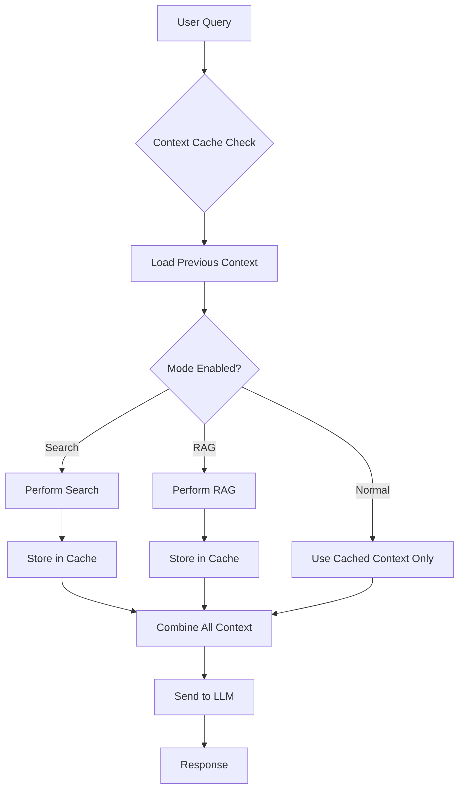

# TTLCache Context Implementation for OfflineLM

## Overview

This implementation adds persistent context caching to OfflineLM using `cachetools.TTLCache`. Context from search results and RAG operations persists across mode toggles and remains available for future LLM interactions.

## Key Features

✅ **Persistent Context**: Search and RAG contexts are cached and available even when modes are disabled  
✅ **Cross-LLM Support**: Works with Ollama, Groq, and all modes (Search, RAG, Normal Chat)  
✅ **System Message Preservation**: System messages from config.yaml are always preserved after clear operations  
✅ **Automatic Cleanup**: TTL-based expiration prevents memory bloat  
✅ **Thread-Safe**: Handles concurrent requests safely  
✅ **Session-Scoped**: Context isolated per conversation session  

## Architecture

### Core Components

1. **ConversationContextCache** (`context_cache.py`)
   - TTL cache for automatic cleanup (45 minutes default)
   - Session-scoped storage with relevance scoring
   - Thread-safe operations with RLock

2. **Context Data Models**
   ```python
   @dataclass
   class SearchContext:
       query: str
       results: List[Dict]
       timestamp: datetime
       session_id: str
   
   @dataclass  
   class RagContext:
       query: str
       chunks: List[str]
       source_text: str
       timestamp: datetime
       session_id: str
   ```

3. **Integration Points**
   - `fastapi_streaming_improved.py`: Enhanced with context loading and storage
   - `basic_ollama_agent_with_post.py`: Updated clear_history to preserve system messages
   - `config.yaml`: System messages for different modes (chat_mode, search_mode)

### Context Flow



## API Endpoints

### Enhanced Endpoints
- `POST /chat/stream-sse-v2`: Automatic context loading and storage
- `POST /clear-conversation/{session_id}`: Clear conversation, preserve context and system message
- `POST /clear-everything/{session_id}`: Clear everything except system message

### New Endpoints
- `GET /context-status/{session_id}`: Get context cache status
- `GET /cache-stats`: Get comprehensive cache statistics

## Usage Examples

### 1. Context Persistence Example

```python
# Session starts with search enabled
response1 = chat("What is Python caching?", search_enabled=True)
# -> Searches web, stores results in cache

# User turns off search mode
response2 = chat("Give me more details about TTL caches", search_enabled=False) 
# -> Still uses cached search results from previous query
```

### 2. Cross-Mode Context Sharing

```python
# Search finds information about caching
response1 = chat("Python caching libraries", search_enabled=True, rag_enabled=False)

# RAG processes the search results
response2 = chat("Explain the benefits", search_enabled=False, rag_enabled=True)
# -> RAG can process cached search results

# Normal chat with all accumulated context
response3 = chat("Which approach is best?", search_enabled=False, rag_enabled=False)
# -> Uses both cached search and RAG contexts
```

### 3. System Message Preservation

```python
# System message from config.yaml:
system_message = "You are a helpful AI assistant..."

# After clear operation:
clear_conversation(session_id)
# -> Conversation history cleared
# -> Context cache preserved (optional)
# -> System message automatically restored
```

## Configuration

### TTL Cache Settings
```python
context_cache = ConversationContextCache(
    ttl_minutes=45,      # Context expires after 45 minutes
    maxsize=1000         # Maximum 1000 cache entries
)
```

### Context Limits
- `max_search_history`: 5 searches per session
- `max_rag_history`: 3 RAG contexts per session  
- `max_context_length`: 2000 characters in LLM prompts

### System Messages (config.yaml)
```yaml
system_instructions:
  chat_mode: |
    You are a helpful AI assistant. Provide clear, accurate responses.
  
  search_mode: |
    You are a helpful AI assistant with web search capabilities.
    Always cite sources when using search results.
```

## Context Relevance Scoring

The cache implements intelligent context selection:

### Search Context Scoring
- **Recency Score** (30%): Newer searches weighted higher
- **Query Similarity** (70%): Keyword overlap with current query

### RAG Context Scoring  
- **Recency Score** (20%): Recent RAG operations
- **Query Similarity** (50%): Query keyword overlap
- **Content Relevance** (30%): Query terms in chunks

## Memory Management

### Automatic Cleanup
- **TTL Expiration**: 45-minute lifespan per context
- **Size Limits**: Maximum entries per cache type
- **Session Cleanup**: Full session removal on clear

### Memory Efficiency
- Context summarization for old entries
- Duplicate detection and removal
- Configurable length limits

## Error Handling

### Graceful Degradation
```python
try:
    cached_context = get_context_for_llm(session_id, query)
except Exception as e:
    logger.error(f"Context retrieval failed: {e}")
    cached_context = ""  # Continue without context
```

### Fallback Behavior
- Cache failures don't break LLM interactions
- Missing context gracefully handled
- System messages always preserved

## Testing

Run the test script to verify functionality:

```bash
python test_context_cache.py
```

Expected output:
- ✅ Context storage and retrieval
- ✅ Session isolation
- ✅ Relevance scoring
- ✅ Persistence across mode toggles
- ✅ Cache statistics

## Installation

1. **Install Dependencies**
   ```bash
   pip install -r requirements_streaming.txt
   # cachetools>=5.0.0 is included
   ```

2. **Import Context Cache**
   ```python
   from context_cache import context_cache, add_search_context, add_rag_context
   ```

3. **Start Server**
   ```bash
   python fastapi_streaming_improved.py
   ```

## Benefits

### For Users
- **Contextual Continuity**: Previous search/RAG results inform future conversations
- **Mode Flexibility**: Toggle modes without losing accumulated knowledge
- **Consistent Experience**: System message always present

### For Developers  
- **Simple Integration**: Drop-in enhancement to existing code
- **Performance Optimized**: TTL cache with efficient lookup
- **Monitoring Ready**: Comprehensive statistics and status endpoints

## Future Enhancements

1. **Persistent Storage**: Add disk-backed cache for server restarts
2. **Context Summarization**: Compress old contexts into summaries
3. **Advanced Relevance**: Semantic similarity scoring with embeddings
4. **Context Visualization**: Frontend display of active contexts
5. **Export/Import**: Save/load context between sessions

---

**Implementation Status: ✅ Complete**

All LLM modes (Ollama, Groq, Search, RAG) now support persistent context with system message preservation. The TTL cache ensures memory efficiency while providing contextual continuity across conversation sessions.